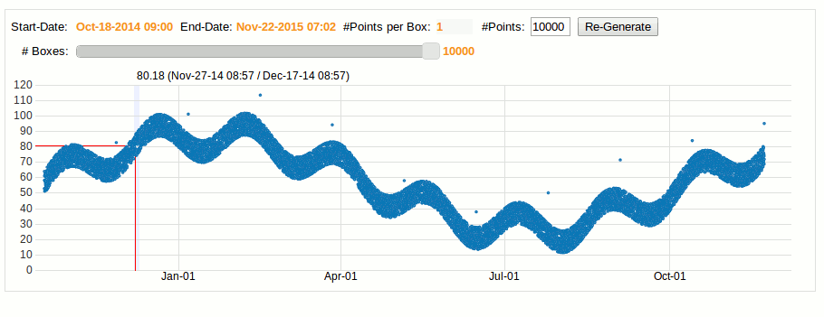
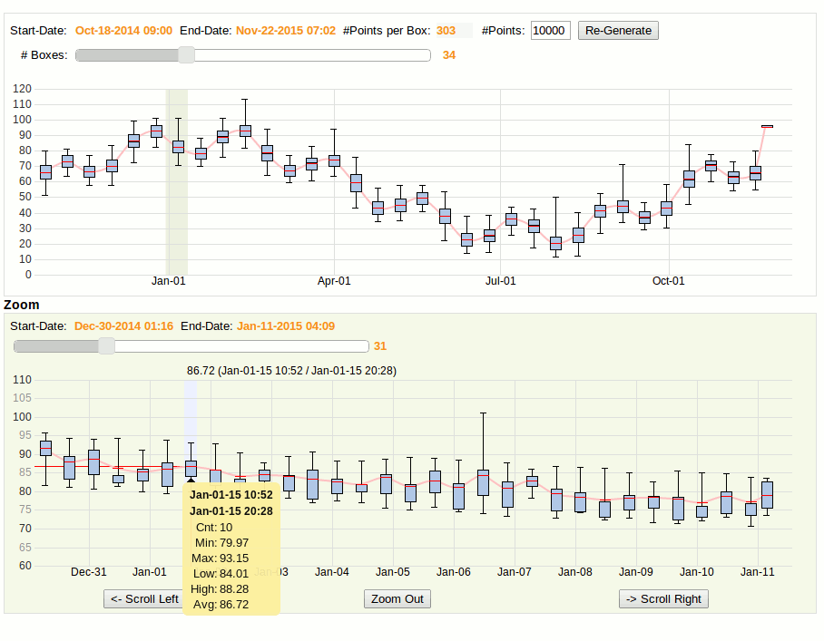
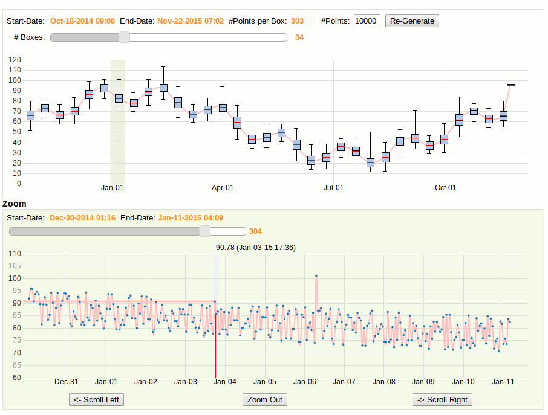

boxchart-graph
==============

**Fast Rendering of large time-series on interactive graphs using Box Plot (http://en.wikipedia.org/wiki/Box_plot), Ruby and Protovis.**

Displaying time-series graphs with Protovis works very well until the number of points gets too large. Trying to display 
hundreds of thousands of points is very slow and hard to read. 
Of course, it's possible to just send averages to the browser and aggregate the points by hours or days on the server.
This solves the speed problem because aggregation on the server can be very fast, but information is lost,
for example outliers that are far from the average.

To solve both problems, this prototype will generate boxplots (also called box&whiskers) on the server and store in 
each box the average, min, max, low, high, median and # of points. The aggregation level will be controlled by the browser
and it will be interactive so that the user can change the aggregation level dynamically and drill-down/explode a selected boxplot.
This allows to visualize the time-series with little degradation and still be able to quickly drill-down from box to points. Other visualizaton technique like color-density graph could be used but boxpot gives a visual representation of
the statistical distribution of the points in each box (min,max..) with the average of the box in red. It also attempt to
connect the averages using a protovis interpolation function.

Here is an example with 10K points and the detail-level at 100% where all the 10K points are displayed: The shape
of the graph is still clear, the outliers are visible but the rendering is very slow and it's hard to select anything.

With the aggregation level set to 34, the server only sends 34 boxes, each with information about 303 points: The graph is more readable,
rendering is instantaneous, the outliers are still visible and it's easy to drill-dow. Outliers (min or max) are seen as long 'whiskers'. The height of each box represent the location of the middle 50% of the points in the box. The red line is the average and the black like (in the box) is the median.
[Re-Generate] can be used to generate a different number of points on the server.

When adjusting the Zoom page to show all the points, the normal graph is shown for the region selected. Only 304 points
are displayed so rendering is still fast. Panning right/left can be done on the Zoom page at every aggregation level
while highlighting the zoom region on the main graph.

This prototype generate points in the shape of 2 waves with outliers every 1000 points.

To run the application, install gem , ruby and run:
$ ruby ./app.rb

then point your chrome browser to localhost:4567/html/boxstats.html

Todo: Adding reactivity  to the graph (for example with Websocket/Ractivejs or Vert.x) makes it even more interesting
because while the number of points is increasing over time, the graph can still remain at the same granularity. 
Nice.

